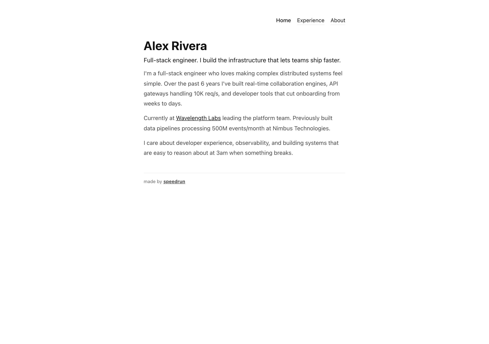
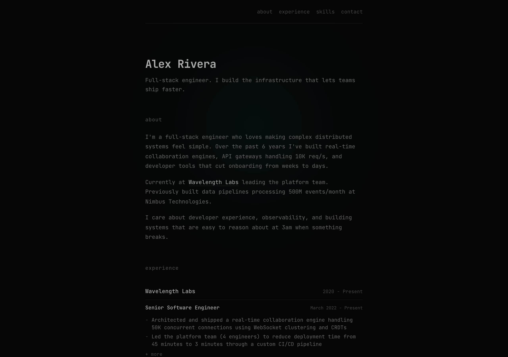
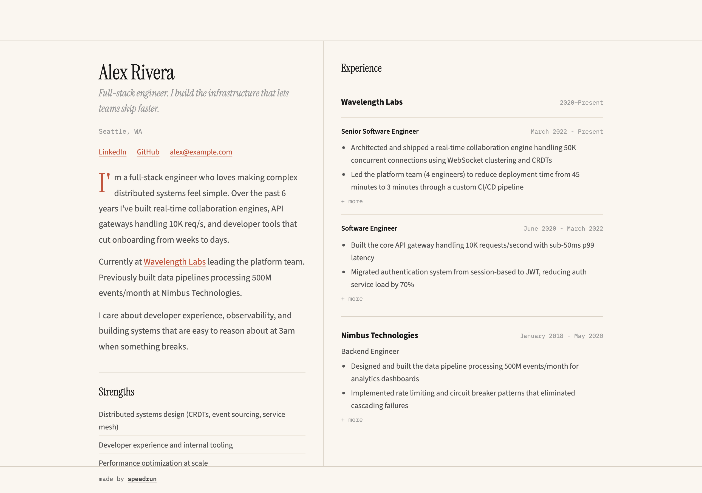
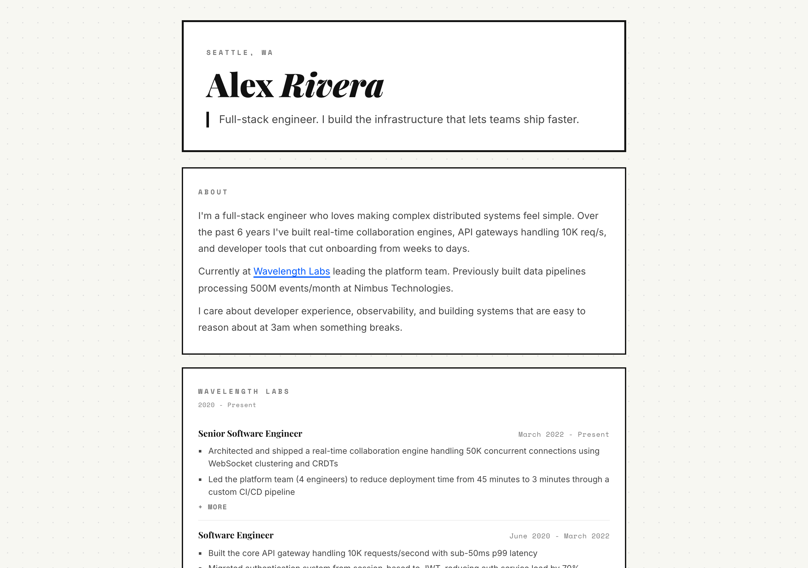
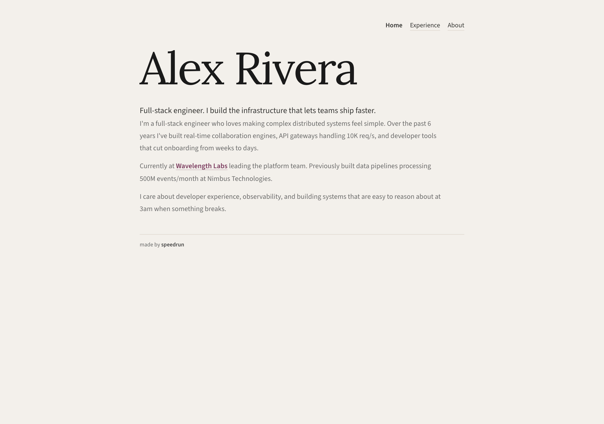
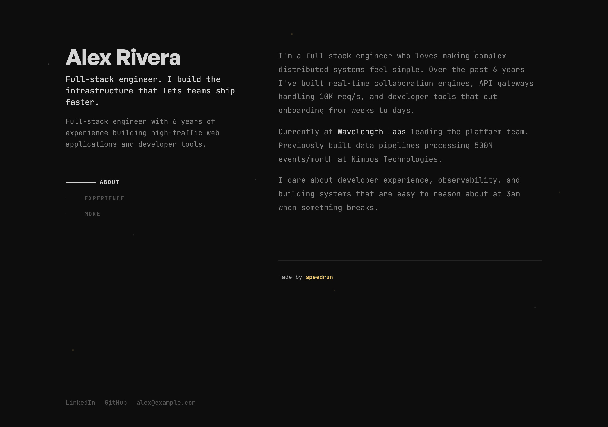

# 168 portfolio templates. Two commands. Free.

```
npx your-personal-readme
claude
```

That's it. Claude walks you through onboarding, builds your portfolio, and deploys it to GitHub Pages in under 5 minutes.

---

## What you get

21 visual styles x 8 layout structures = 168 unique portfolio combinations. Every one is responsive, accessible, and deploys as a single static HTML file with zero dependencies.

### Template gallery

**Clean & Minimal** -- `bare` x `multipage`
System fonts, no decoration, just the words.



**Dark & Technical** -- `void` x `scroll`
Near-black with radial glow, hacker minimal.



**Warm & Editorial** -- `ink` x `spread`
Warm serif, magazine feature energy.



**Bold & Confident** -- `press` x `cards`
Neo-brutalist boxes, thick borders, offset shadows.



**Warm & Organic** -- `garden` x `multipage`
Cream background, soft serif, handmade energy.



**Dark & Technical (alt)** -- `terminal` x `sidebar`
Dark + gold + monospace, late-night shipping session.



These are 6 of 168 combinations. Mix any style with any layout.

## How it works

### 1. Install and run

```
npx your-personal-readme
cd my-portfolio
claude
```

### 2. Onboarding

Claude reads your resume (paste, LinkedIn PDF, or just describe yourself). It extracts everything, confirms with you, and builds your profile.

### 3. Build and deploy

Pick a template or say "just build it" for the default. Claude generates your site and deploys to GitHub Pages. Done.

## Style x Layout system

Styles control the visuals: colors, fonts, spacing, personality.
Layouts control the structure: page count, navigation, content arrangement.

Mix any style with any layout. The system validates combinations and warns you about ones that don't work well.

```bash
# Generate one combo
node combine-portfolio.mjs --style=ink --layout=multipage

# Generate all valid combos
node combine-portfolio.mjs --all

# Demo mode (uses sample data)
node combine-portfolio.mjs --demo

# Validate all styles
node validate-styles.mjs

# Run test suite
npm test
```

## For students

The onboarding detects whether you're a student, early career, or experienced professional and adapts the flow. Students get:
- Positioning strategy choice (academic-forward, builder-forward, or appear-experienced)
- Projects deep-dive instead of work history focus
- Activities and research sections
- Education-prominent layouts

## For developers

The system is designed to be extended. Add a new style by creating `styles/your-style.mjs` that exports `name`, `fonts`, and `css()`. Add a new layout by creating `layouts/your-layout.mjs` that exports `name`, `description`, `css()`, and `pages(data)`.

```bash
# Lint your new style
node validate-styles.mjs

# Test everything
npm test
```

## Beyond portfolios

This is also a full AI job search tool: role evaluation, resume generation, interview prep, offer comparison, and direct connection to the a16z speedrun talent network (500+ startups).

Type `/speedrun` in Claude Code to explore everything.

---

**made by the a16z speedrun team**
